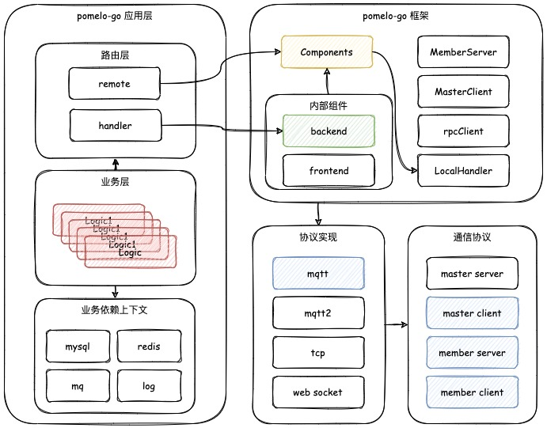

# pomelo-go

pomelo go服务框架

通过go实现pomelo通信协议，接入到node pomelo集群


## 框架
整体的框架图，如下所示:



各个模式的作用分为:
1. clusterpb: pomelo集群内部的通信协议，目前只完成了mqtt的协议实现
2. server: pomelo-go的服务框架实现，一个进程只启动一个server实例，其内部处理服务注册，服务发现，接收服务消息，路由分发等工作
3. LocalHandler: 处理本地或远程Handler调用
4. masterClient: 与master通信的客户端 对应node pomelo的monitor模块
5. rpcClient: member client的消息通信连接池
6. memberServer: 本服务的MemberServer服务代理

## example

```shell
参考 app/custom/main

```

## TODO LIST

```shell
1. handler中间件（系统配置+用户自定义）、超时控制
2. master服务注册边界场景
3. 对外RPC调用
4. 前端服务实现支持
5. master服务实现支持

```